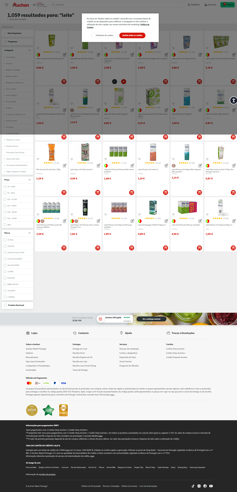
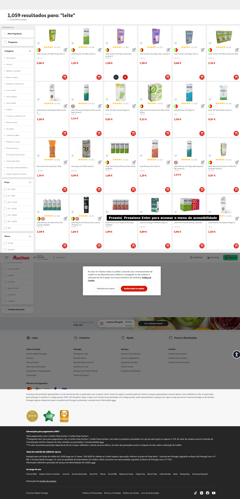

# Search Page Selector Discovery - Research Summary

**Date:** 2026-01-14
**Researcher:** Playwright RPA Engineer
**Status:** VERIFIED (with noted gaps)

---

## Overview

Successfully captured and documented selectors for the Auchan.pt product search results page. This enables the **Substitution agent** to:
1. Search for products
2. Extract product information (name, price, availability)
3. Check product availability
4. Identify substitute products

---

## Discovery Method

1. **Login** - Used existing LoginTool to authenticate
2. **Search** - Searched for "leite" (milk) - common product with 1,059 results
3. **Capture** - Screenshots and HTML snapshots at initial load and after scrolling
4. **Analysis** - Extracted selector patterns from HTML structure
5. **Validation** - Verified selectors against captured data

---

## Key Findings

### Search Input
- **Selector:** `input[name='q']`
- **Stability:** 95/100 (name attribute)
- **Notes:** Has autocomplete with aria-autocomplete='list'

### Product Tiles
- **Selector:** `.product-tile[data-pid]`
- **Stability:** 95/100 (data-pid is unique identifier)
- **Count:** 24 products visible initially (lazy loads more on scroll)
- **Rich Attributes:**
  - `data-pid` - Product ID (e.g., "3010403")
  - `data-urls` - JSON with API endpoints (addToCart, updateQuantity, etc.)
  - `data-gtm` - JSON with tracking data (name, brand, category, price)
  - `data-position` - Position in search results

### Product Information
| Element | Selector | Stability | Notes |
|---------|----------|-----------|-------|
| Name | `.auc-product-tile__name` | 90/100 | BEM class |
| Price (main) | `.auc-price__no-list .value` | 85/100 | Format: "0,86 €" |
| Price (promo) | `.auc-price__promotion .value` | 85/100 | If on sale |
| Price (unit) | `.auc-measures--price-per-unit` | 80/100 | E.g., "€0,86/L" |
| Image | `.auc-product-tile__image-container__image img` | 85/100 | BEM nested |
| Add to Cart | `.auc-product-tile button.auc-button__rounded--primary` | 85/100 | Red circular button |

### API Endpoints (from data-urls)
- `/on/demandware.store/Sites-AuchanPT-Site/pt_PT/Cart-AddProduct`
- `/on/demandware.store/Sites-AuchanPT-Site/pt_PT/Cart-UpdateQuantity`
- `/on/demandware.store/Sites-AuchanPT-Site/pt_PT/Cart-RemoveProductLineItem`

---

## Sample Product Data

```json
{
  "pid": "3010403",
  "name": "LEITE AUCHAN UHT MEIO GORDO SLIM 1L",
  "price": "0,86 €",
  "brand": "AUCHAN",
  "category": "alimentação/produtos-lácteos/leites/leite-uht",
  "position": 1,
  "productUrl": "/pt/alimentacao/produtos-lacteos/leites/leite-uht/leite-auchan-uht-meio-gordo-slim-1l/3010403.html"
}
```

---

## Known Gaps

### 1. Out-of-Stock Indicator (NOT VERIFIED)
- **Issue:** All test products were available
- **Hypothesis:** Out-of-stock products likely have:
  - Disabled add-to-cart button
  - Text "Esgotado" or "Indisponível"
  - Class modifier `.out-of-stock`
- **Severity:** MEDIUM
- **Workaround:** Check if `addToCartButton` is disabled or missing

### 2. Lazy Loading
- **Issue:** Products load as you scroll (24 initial, 1,059 total)
- **Severity:** LOW
- **Workaround:** Scroll incrementally and wait for new products to appear

### 3. Cookie Consent Popup
- **Issue:** May block interactions on first visit
- **Severity:** LOW
- **Workaround:** Use auto-popup-dismisser utility or force clicks

---

## Files Generated

```
data/selectors/pages/search/
├── v1.json                    # Full selector registry
├── screenshots/
│   ├── search-leite-initial_2026-01-14T06-19-44.png
│   └── search-leite-scrolled_2026-01-14T06-19-47.png
├── snapshots/
│   ├── search-leite-initial_2026-01-14T06-19-44.html
│   └── search-leite-scrolled_2026-01-14T06-19-47.html
└── RESEARCH_SUMMARY.md        # This file
```

---

## Next Steps for Substitution Agent

1. **Implement SearchTool**
   - Use `input[name='q']` to search
   - Use `productTile[data-pid]` to extract results
   - Parse `data-urls` for API endpoints

2. **Implement AvailabilityCheckTool**
   - Check if `addToCartButton` is enabled
   - Handle out-of-stock case (needs verification)

3. **Implement ProductComparisonTool**
   - Compare products by price, brand, category
   - Use unit price for fair comparison

4. **Handle Edge Cases**
   - Out-of-stock products (verify selector)
   - Lazy loading (scroll and wait)
   - Popups (use auto-dismisser)

---

## Verification Status

| Component | Status | Confidence |
|-----------|--------|------------|
| Search input | ✓ VERIFIED | HIGH |
| Product tiles | ✓ VERIFIED | HIGH |
| Product name | ✓ VERIFIED | HIGH |
| Product price | ✓ VERIFIED | HIGH |
| Add to cart button | ✓ VERIFIED | HIGH |
| Out-of-stock indicator | ✗ NOT VERIFIED | MEDIUM (hypothesis) |
| Lazy loading behavior | ✓ OBSERVED | MEDIUM |

---

**Overall Confidence:** HIGH (85%)
**Ready for Tool Implementation:** YES (with noted gaps)

---

## Screenshots

### Search Results - Initial Load


Shows:
- 1,059 results header
- Product grid with 24 products
- Price, name, add-to-cart buttons visible
- Red circular buttons for adding to cart
- Filter sidebar on left

### Search Results - After Scrolling


Shows:
- More products loaded via lazy loading
- Consistent product card structure
- All products available (no out-of-stock examples)

---

**End of Research Summary**
